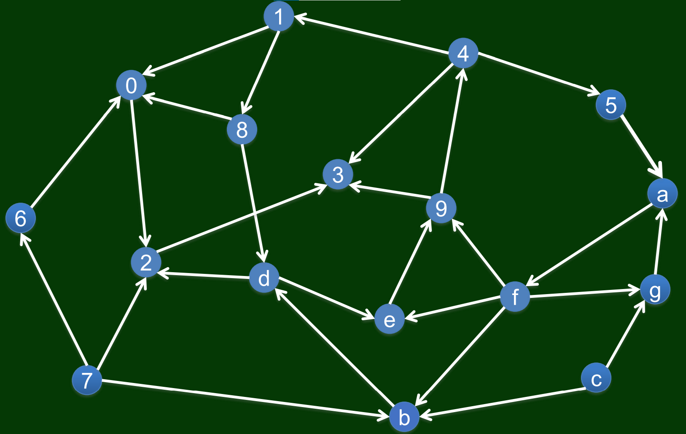
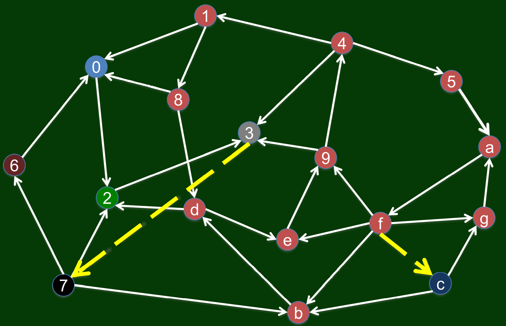
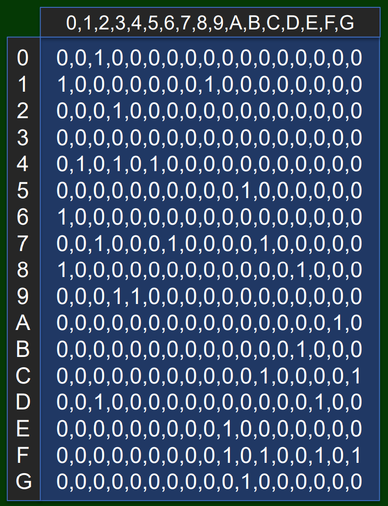

# Augmenting Directed Graph

A strongly connected graph is a directed graph that has a path from each vertex to every other vertex. This programme augments a directed graph into a strongly connected graph by adding the least edges possible. 

Take the graph below for example. This graph is a directed graph, but is not strongly connected (for instance, point 3 does not connect to any other point). 



We can augment this graph by adding 2 edges to make it strongly connected, as shown in the figure below. 



It can be proven that 2 is the least amount of edges possible to make this graph strongly connected. 

## Input and output

A directed graph can be expressed by an *adjacency matrix*. For a directed graph with $n$ points, its adjacency matrix has a order of $n$, composed of 0 and 1. If the element in the $i\mathrm{th}$ row and the $j\mathrm{th}$ column is 1, then there is a edge from point $i$ to point $j$. Otherwise there are no such edges. For example, the adjacency matrix of the directed graph mentioned above is shown in the figure below. 



Input a directed graph using its adjacency matrix in the following form:

```
0,0,1,0,0,0,0,0,0,0,0,0,0,0,0,0,0
1,0,0,0,0,0,0,0,1,0,0,0,0,0,0,0,0
0,0,0,1,0,0,0,0,0,0,0,0,0,0,0,0,0
0,0,0,0,0,0,0,0,0,0,0,0,0,0,0,0,0
0,1,0,1,0,1,0,0,0,0,0,0,0,0,0,0,0
0,0,0,0,0,0,0,0,0,0,1,0,0,0,0,0,0
1,0,0,0,0,0,0,0,0,0,0,0,0,0,0,0,0
0,0,1,0,0,0,1,0,0,0,0,1,0,0,0,0,0
1,0,0,0,0,0,0,0,0,0,0,0,0,1,0,0,0
0,0,0,1,1,0,0,0,0,0,0,0,0,0,0,0,0
0,0,0,0,0,0,0,0,0,0,0,0,0,0,0,1,0
0,0,0,0,0,0,0,0,0,0,0,0,0,1,0,0,0
0,0,0,0,0,0,0,0,0,0,0,1,0,0,0,0,1
0,0,1,0,0,0,0,0,0,0,0,0,0,0,1,0,0
0,0,0,0,0,0,0,0,0,1,0,0,0,0,0,0,0
0,0,0,0,0,0,0,0,0,1,0,1,0,0,1,0,1
0,0,0,0,0,0,0,0,0,0,1,0,0,0,0,0,0
```

And the programme will output the adjacency matrix of the augmented graph:

```
0,0,1,0,0,0,0,0,0,0,0,0,0,0,0,0,0
1,0,0,0,0,0,0,0,1,0,0,0,0,0,0,0,0
0,0,0,1,0,0,0,0,0,0,0,0,0,0,0,0,0
0,0,0,0,0,0,0,0,0,0,0,0,1,0,0,0,0
0,1,0,1,0,1,0,0,0,0,0,0,0,0,0,0,0
0,0,0,0,0,0,0,0,0,0,1,0,0,0,0,0,0
1,0,0,0,0,0,0,0,0,0,0,0,0,0,0,0,0
0,0,1,0,0,0,1,0,0,0,0,1,0,0,0,0,0
1,0,0,0,0,0,0,0,0,0,0,0,0,1,0,0,0
0,0,0,1,1,0,0,0,0,0,0,0,0,0,0,0,0
0,0,0,0,0,0,0,0,0,0,0,0,0,0,0,1,0
0,0,0,0,0,0,0,0,0,0,0,0,0,1,0,0,0
0,0,0,0,0,0,0,1,0,0,0,1,0,0,0,0,1
0,0,1,0,0,0,0,0,0,0,0,0,0,0,1,0,0
0,0,0,0,0,0,0,0,0,1,0,0,0,0,0,0,0
0,0,0,0,0,0,0,0,0,1,0,1,0,0,1,0,1
0,0,0,0,0,0,0,0,0,0,1,0,0,0,0,0,0
```

## Principle

The principle of my method are stated in the following papers:

- Tarjan, R. (1972). Depth-first search and linear graph algorithms. *SIAM journal on computing*, *1*(2), 146-160.
- Eswaran, K. P., & Tarjan, R. E. (1976). Augmentation problems. *SIAM Journal on Computing*, *5*(4), 653-665.
- Raghavan, S. (2005). A note on Eswaran and Tarjan’s algorithm for the strong connectivity augmentation problem. In *The Next Wave in Computing, Optimization, and Decision Technologies* (pp. 19-26). Springer, Boston, MA.

You can also refer to ```Experiment Report.pdf``` for the mathematical proof of my method (it’s written in Chinese). 

Related readings:

- Sharir, M. (1981). A strong-connectivity algorithm and its applications in data flow analysis. *Computers & Mathematics with Applications*, *7*(1), 67-72.
- Pearce, D. J. (2016). A space-efficient algorithm for finding strongly connected components. *Information Processing Letters*, *116*(1), 47-52.
- Frank, A., & Jordán, T. (1995). Minimal edge-coverings of pairs of sets. *Journal of Combinatorial Theory, Series B*, *65*(1), 73-110.
